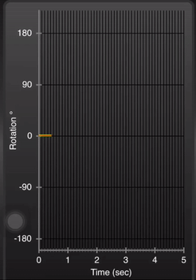

# flutter_sine_chart

Learning exercise for simple charting in flutter. My goal is to have a time dependent
XY plot chart.  One that as you near the end of the available display area, the
plot adjusts itself automatically.  Think EKG chart.  I'm also looking for a display that 
enables good data management.  

## References

Simple, dynamic charting:  
&nbsp;&nbsp;&nbsp;&nbsp;&nbsp;&nbsp;https://medium.com/flutter-io/zero-to-one-with-flutter-43b13fd7b354  
&nbsp;&nbsp;&nbsp;&nbsp;&nbsp;&nbsp;https://medium.com/flutter-io/zero-to-one-with-flutter-part-two-5aa2f06655cb  

&nbsp;&nbsp;&nbsp;&nbsp;&nbsp;&nbsp;Nice introduction to charting, but I really don't need the `lerp` or `tween` techniques for animation.

## Inspiration:

&nbsp;&nbsp;&nbsp;&nbsp;&nbsp;&nbsp;&nbsp;&nbsp;&nbsp;&nbsp;&nbsp;&nbsp;&nbsp;&nbsp;&nbsp;&nbsp;&nbsp;&nbsp;&nbsp;&nbsp;&nbsp;&nbsp;&nbsp;&nbsp; 

&nbsp;&nbsp;&nbsp;&nbsp;&nbsp;&nbsp; https://www.rotoview.com/sensor_kinetics.htm  
&nbsp;&nbsp;&nbsp;&nbsp;&nbsp;&nbsp; Sensor Kinetics App, available in iOS and Android with a free, very functional, demo. (Screenshot above.)
This all in one toolkit gives charts, graphs, and more to learn gravity, movement, vibrations, and magnetic fields around you. Try it just for fun, or use it to collect data for your next science experiment!

## Getting Started

 - Step One: Create simple chart, understand how to paint something simple on the canvas.
 - Step Two: Understand how repaints and their triggers work.
 - Step Three: Jump over to an XY plot (Sine wave) instead of a bar chart. Understand how offsets work.
 - Step Four: Understand how the canvas element is placed on screen.  Its not as obvious as one might think.  
 - Step Five: Slide the visibility window along with the data.
 - Step Six: Let's try a time dependent trigger for our data.s

